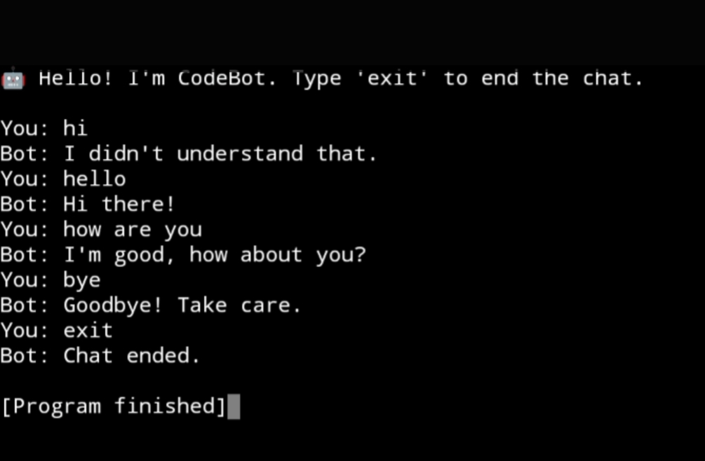

# Codealpha-task-4
Python domain  
# 🧩 CodeAlpha - Task 4 (Python Domain Internship)

This repository showcases **Task 4** completed during my **Python Development Internship** at **CodeAlpha**. It focuses on applying Python to solve real-time problems using structured logic and effective programming practices.

---

## 📁 Repository Contents

- `Task4.py` – Python script implementing Task 4  
- `Screenshot_2025-07-29-17-42-39.jpg` – Output Screenshot 1  
- `Screenshot_2025-07-29-17-43-19.jpg` – Output Screenshot 2  

---

## 📌 Task 4 Details

| Field           | Description                                                       |
|----------------|-------------------------------------------------------------------|
| **Task Name**   | [Insert task title, e.g., "Digital Clock using Python"]          |
| **Description** | [Add a short summary, e.g., "Displays the current time in GUI"]  |
| **Status**      | ✅ Completed                                                      |

---

## ⚙️ Technologies Used

- **Language:** Python 3.x  
- **IDE/Editor:** VS Code / Any Preferred Editor  
- **Libraries/Concepts:** [e.g., Tkinter, Time Module, Loops, GUI Programming]

---

## 📸 Screenshots

| Screenshot | Description                  |
|------------|------------------------------|
|  | GUI or Output Interface |
|  | Real-time Output Sample |

---

## 🙌 Acknowledgment

Thanks to **CodeAlpha** for this learning opportunity. Each task was designed to push my Python skills further and give practical exposure to real-world applications.

---

## 🔗 Connect with Me

- **GitHub:** [@ARAVINDKUMARGS](https://github.com/ARAVINDKUMARGS)  
- **LinkedIn:** [Aravind Kumar](https://www.linkedin.com/in/aravind-kumar)

---

> ⭐ If you found this useful, feel free to give this repo a star!
